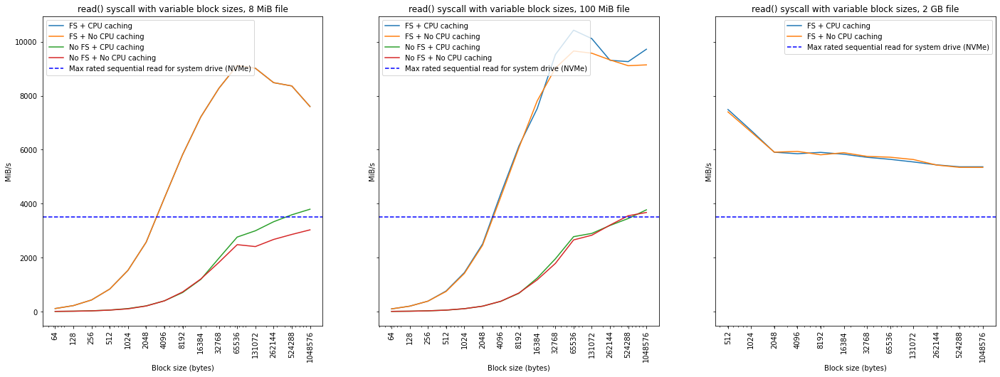
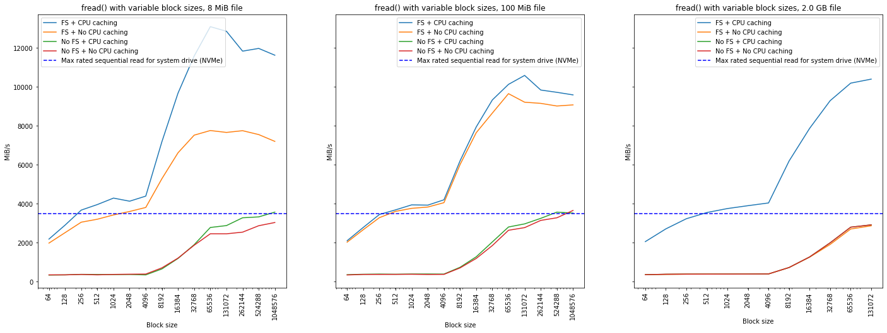
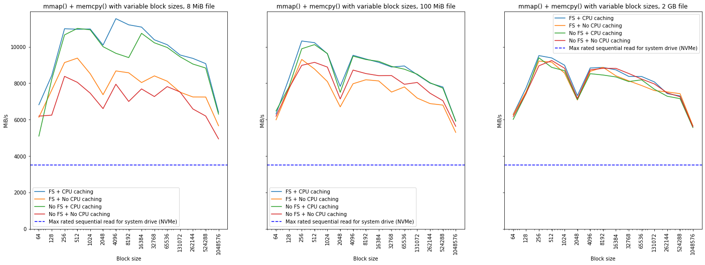
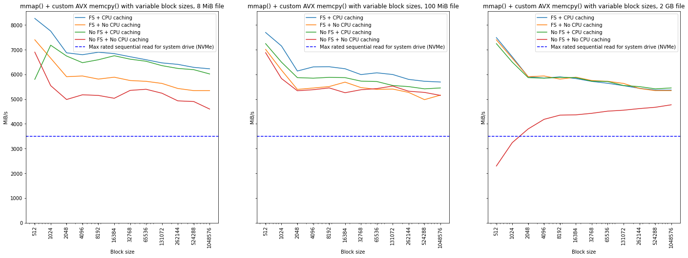

# Final Project Report
## CS-GY 6233 Fall 2021

```
Name: Casey Primel
NetID: ctp219
```

Or, how to make the disk go brrrrr.

All code for the project can be found in the [project repository](https://github.com/cprimel/cs6233-final-project). To run locally, `git clone https://github.com/cprimel/cs6233-final-project.git`. 

To build all the project files, simply run `./build.sh` in the project root. This will place all executables in `<project_root>/release`.

## 1. Basics

For part 1, run `.\release\run <filename> [-r|-w] <block_size> <block_count>`. The program will output the XOR of the file or the specified portion thereof to the terminal.

## 1. Measurement

For part 2, run `.\release\run2 <file_name> <block_size>`. The program will output the file size that can be read in 0.5 seconds. 

## 3. Raw performance / 4. Caching

I have combined these two sections since they deal with the same thing. Benchmark executables can be found under `<project_root>\release`. Benchmark executables will run a series of trials and output performance data to the terminal as well as log the benchmark in a `.csv` file in `<project_root>/publish/data`. 

To run a benchmark, you need to pass in the arguments below. All are required.
```shell
$ ./release/<bench_mark_executable> <filename> [filesystem_cache?: -y|-n] [cpu_cache? -y|-n] <block_size> <block_count>
```

- `filename`: name of the file you want to use for the benchmark.
- `filesystem_cache?`: `-n` will use `O_DIRECT` flag for opening the file and drop the file system cache between each benchmark. The former does not guarantee behavior but is more a 'suggestion' to the OS. The latter requires that the program is being run with root privileges.
- `cpu_cache?`: `-n` will attempt to clear CPU cache between each benchmark. This significantly slows down the benchmark execution since its necessary to do something that the compiler cannot just optimize away.
- `block_size`: Same as above, but setting to `0` tells the executable to run benchmarks on several block sizes and to report the best one.
- `block_size`: Same as above, but setting to `0`' tells the executable to run the benchmark on the entire file. **Warning**: If both `block_size` and `block_count` are set to `0`, you will end up reading the specified file 300 times.

### Results

The results of benchmarks on my personal system are presented below with some commentary. The benchmarks are running on i7-8750H (Coffee Lake) with 64 GB RAM and an NVMe with a max rated sequential read speed of 3500 MB/s.

Each benchmark was run on file sizes of 8 MiB, 100 MiB, and 2 GB, to test for variations due to file size. TLDR, file size has some effect but it is hard to generalize about.

#### read() system call


The above show the results for `read()` system calls, with variable block size and file size. Block size is a major factor for performance with `read()` as it is for all the other approaches taken here. Disabling filesystem caching effectively cuts the speed of reading via `read` by more than 50%. CPU caching has some effect, but not to nearly the same degree as it does for `fread()` as we'll see. Note, the last chart does not include data for the cases with disabled filesystem caching... because it takes too long to run! 

#### fread() standard C library function


`fread()` is an optimized standard C library function for reading files, so it is not surprising that it runs faster than `read()` and the other approaches tried here. It accomplishes this by adding an additional buffering in userspace that allows it to *reduce* the number of underlying system calls. Interestingly, CPU caching plays a much larger role here than it does for any of the other approaches, conceivably because that user-space buffering is happening in the L2/L3 cache. Regarding block size, we see a similar peaking of performance at 64 KiB block sizes. 

#### mmap() + memcpy() system calls



Well, what if we just moved memory around instead? `mmap()` maps the file to the processes virtual address space and `memcpy()` copies from the source memory to the destination memory. That's it! CPU caching is more important here than filesystem caching, because this approach bypasses the filesystem cache entirely for the most part. Interestingly, there is much less variation across block sizes though 2 KiB seems to be pathological from a performance standpoint while 256 bytes seems to be the peak. I'd reason that the peak is related to compiler vectorization on an architecture with AVX. The most interesting thing about this approach is that the performance is reliably **faster** than the stated sequential read time for the NVMe it is running on. The NVMe does have its own caching which is, perhaps, playing a greater role when `memcpy()` is called but that is just conjecture at this stage. 

#### mmap() + custom memcpy()



Okay, so you *could* write your own version of `memcpy()` using intrinsics. However, you are not going to beat the compiler when it comes to something like reading files. 512 bytes is the minimum block size that can be handled on the `memcpy()` I implemented because of the width of the vector instructions and loop unrolling. Even at its peak performance, it still underperforms standard `mmap()` + `memcpy()`.


## 5. System calls

For part 5, run `.\release\run5 <filename>`. 

Results run on my system show only a marginal difference between the rate at which `read()` and `lseek()` calls are made. The call rate is given below in B/s and B/ms since the latter is easier to read and compare.

* Read rate for byte-by-byte: 1.6 MiB/s
* Read call rate: 1.69023e+06 B/s
* Read call rate: 1690.23 B/ms
* Seek call rate: 2.65858e+06 B/s
* Seek call rate: 2658.58 B/ms


## 6. How fast can you go

For part 6, run `.\release\fast <filename>`. No secret sauce, just `fread()` using a block size of 128 KiB since it was shown to be fastest in the analysis above!  
